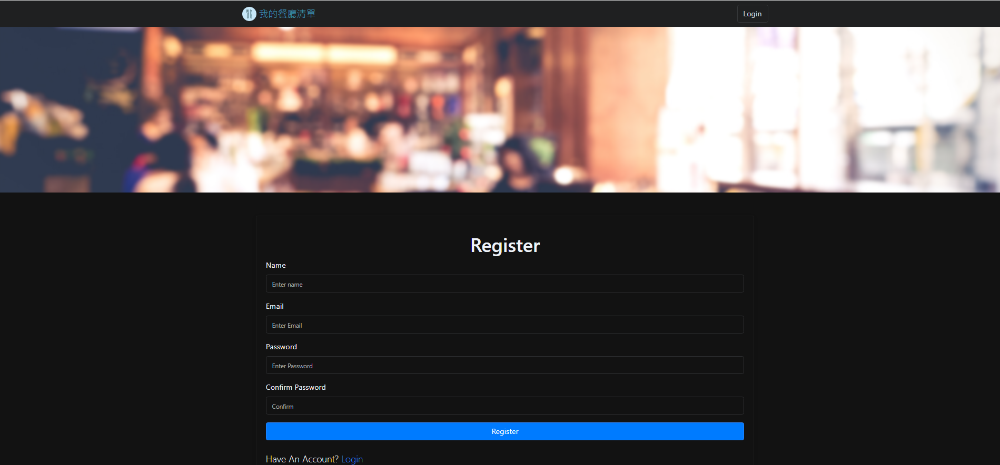
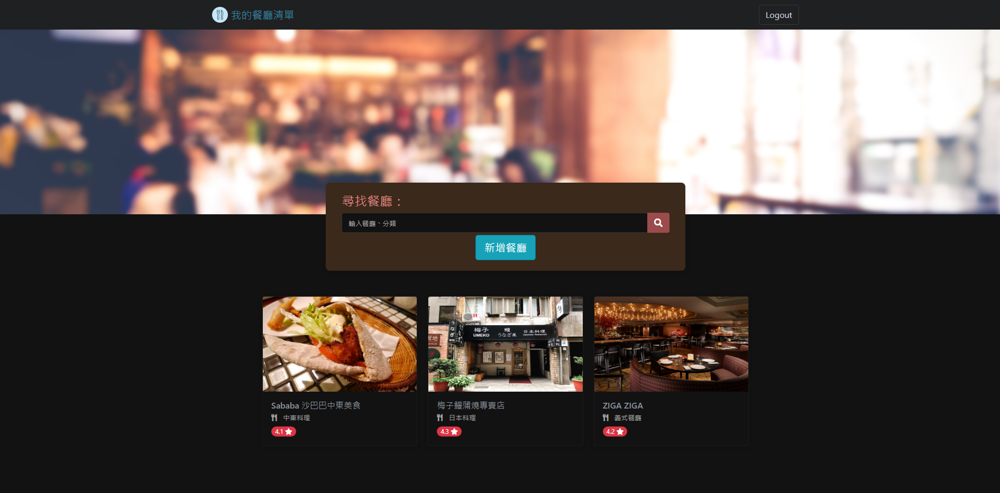
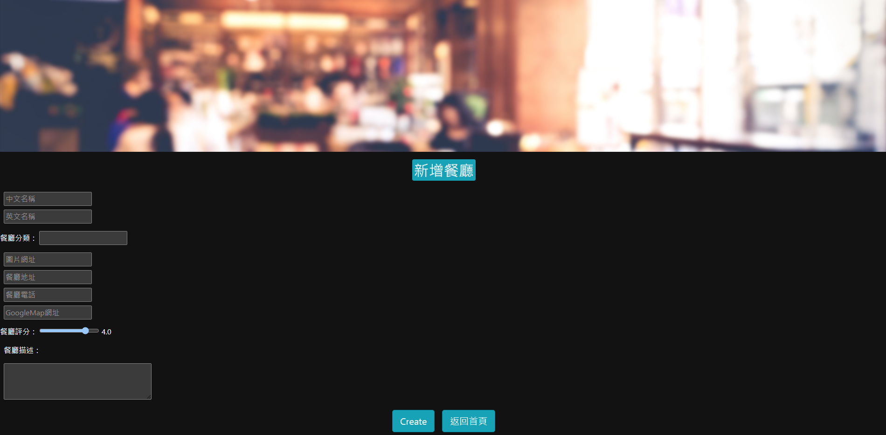

# restaurant_list
# 我的餐廳清單

使用者須先註冊、登入，便可建立自己專屬的餐廳清單。
包含新增、修改、刪除及查詢功能。
清單內容可以查看類別、簡介、地址、電話，及評分等餐廳相關資訊。

---

## 專案畫面

### 註冊畫面


### 登入畫面


### 餐廳清單


### 新增清單



---
## 網站功能

- 需註冊後才能使用，亦可使用 Facebook 註冊
- 清單包含餐廳照片、名稱及評分
- 可透過餐廳名稱或餐品種類搜尋
- 新增、修改，及移除清單項目
- 點選店家後，可以瀏覽詳細資訊


## 使用說明

1. 請先確認有安裝 node.js 與 npm
2. 透過終端機，Clone 此專案至本機電腦

```bash
git clone https://github.com/tim250793/restaurant_list/
```

1. 透過終端機，cd 至存放的資料夾
2. 啟動伺服器，執行 app.js 檔案
```bash
   nodemon app.js
```
1. 連結後，開啟任一瀏覽器瀏覽器輸入 http://localhost:3000/ 開始使用

## 環境建置與需求 (prerequisites)

- "bcrypt": "^5.0.1",
- "bcryptjs": "^2.4.3",
- "body-parser": "^1.20.0",
- "connect-flash": "^0.1.1",
- "dotenv": "^16.0.1",
- "express": "^4.18.1",
- "express-handlebars": "^6.0.6",
- "express-session": "^1.17.3",
- "method-override": "^3.0.0",
- "mongoose": "^6.5.3",
- "morgan": "^1.10.0",
- "passport": "^0.6.0",
- "passport-facebook": "^3.0.0",
- "passport-local": "^1.0.0"
